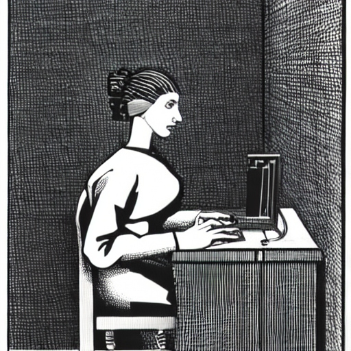
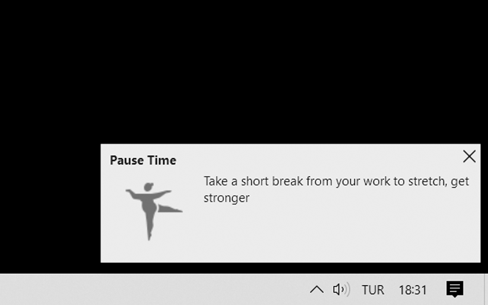
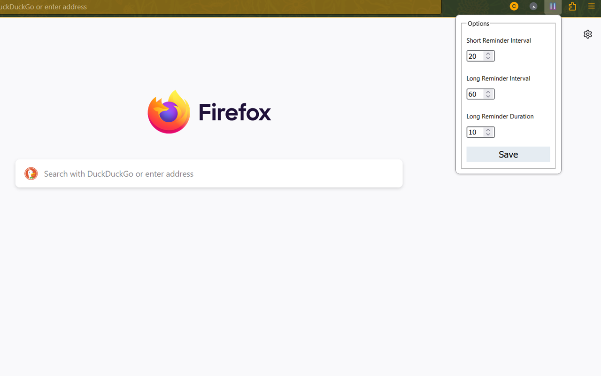

# Stretch & Rest Reminder

Firefox extention reminding you to give a break and look away from screen

WebExtension for Firefox. Set reminders to take...

* **Short Breaks** from work to look around
* **Long Breaks** to stretch, get stronger and chat with your colleagues and friends.

## Features

1. Display random icons and messages
1. Multi language support (Türkçe)
1. Set the amount of time between breaks

## RSI

A repetitive strain injury (RSI) is an injury to part of the musculoskeletal or nervous system caused by repetitive use, vibrations, compression or long periods in a fixed position. Other common names include repetitive stress disorders, cumulative trauma disorders (CTDs), and overuse syndrome.

## Install

The addon is available on firefox [addons page](https://addons.mozilla.org/tr/firefox/addon/stretch-and-rest-reminder/)

## Contact

* www.cemkaan.com

* StackOverFlow: [@cem-kaan](https://stackoverflow.com/users/11993949/cem-kaan "Cem Kaan on stackoverflow")
* LinkedIn: [@cemkaan](https://www.linkedin.com/in/cemkaan/ "Cem Kaan on LinkedIn")

**LiteCoin Address For Donation:** LaF4Kjh7MYh7yYBjBX2CEPjGhZ614ffMh8
